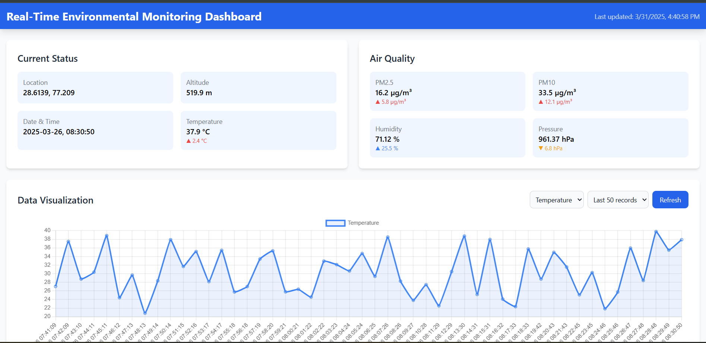
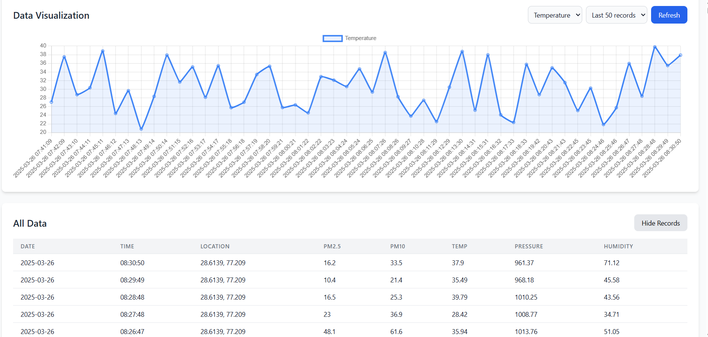

# Environmental Monitoring Dashboard

## website live at - (https://real-time-environment-data-dashboard-v2.vercel.app/)
A responsive web-based dashboard for real-time environmental data visualization and monitoring.




## Overview

This Environmental Monitoring Dashboard provides a modern, responsive interface for visualizing and analyzing environmental data collected from sensors. The dashboard displays real-time metrics including air quality (PM2.5, PM10), temperature, humidity, pressure, and location data in an easy-to-understand format.

## Features

- **Responsive Design**: Works seamlessly on mobile, tablet, and desktop devices
- **Real-time Data Display**: Shows the most recent environmental readings with change indicators
- **Interactive Data Visualization**: Chart visualization with parameter and time range selection
- **Complete Data Records**: Tabular view of all collected data with responsive design for all screen sizes
- **Automatic Updates**: Refresh functionality to get the latest data

## Technologies Used

- **Frontend**:
  - HTML5 / CSS3
  - Tailwind CSS for responsive styling
  - EJS (Embedded JavaScript) for templating
  - Chart.js for data visualization
  - Moment.js for date/time formatting

- **Dependencies**:
  - Tailwind CSS (via CDN)
  - Chart.js (via CDN)
  - Moment.js (via CDN)

## Installation

1. Clone the repository:
   ```bash
   git clone https://github.com/adijain123/Real_time_environment_data_dashboard_v2.git
   cd Real_time_environment_data_dashboard_v2
   ```

2. Install dependencies:
   ```bash
   npm install
   ```

3. Start the application:
   ```bash
   npm start
   ```

4. Access the dashboard in your browser:
   ```
   http://localhost:3000
   ```

## Project Structure

```
environmental-monitoring-dashboard/
├── public/
│   ├── dashboard.js       
├── views/
│   ├── index.ejs           # Main dashboard 
├── app.js                  # Application entry point
└── README.md               # This file
```

## Data Format

The dashboard expects environmental data in the following format:

```javascript
{
  "Date": "2025-03-31",
  "Time": "14:30:00",
  "Latitude": "37.7749",
  "Longitude": "-122.4194",
  "Altitude": "10",
  "PM2.5": "12.5",
  "PM10": "25.3",
  "Temperature": "22.4",
  "Humidity": "45.2",
  "Pressure": "1013.2"
}
```

## Dashboard Sections

1. **Current Status**: Displays the most recent environmental readings with location and time information
2. **Air Quality**: Shows current air quality metrics with trend indicators
3. **Data Visualization**: Interactive chart to visualize environmental parameters over time
4. **All Data**: Complete data records in tabular format (responsive card view on mobile)


### Styling

The dashboard uses Tailwind CSS for styling. Customize the appearance by modifying the Tailwind classes in the HTML templates.

## Browser Compatibility

- Chrome (latest)
- Firefox (latest)
- Safari (latest)
- Edge (latest)
- Mobile browsers (iOS Safari, Android Chrome)

## Contributing

1. Fork the repository
2. Create your feature branch: `git checkout -b feature/amazing-feature`
3. Commit your changes: `git commit -m 'Add some amazing feature'`
4. Push to the branch: `git push origin feature/amazing-feature`
5. Open a Pull Request

## License

This project is licensed under the MIT License - see the LICENSE file for details.

## Acknowledgements

- [Tailwind CSS](https://tailwindcss.com/)
- [Chart.js](https://www.chartjs.org/)
- [Moment.js](https://momentjs.com/)